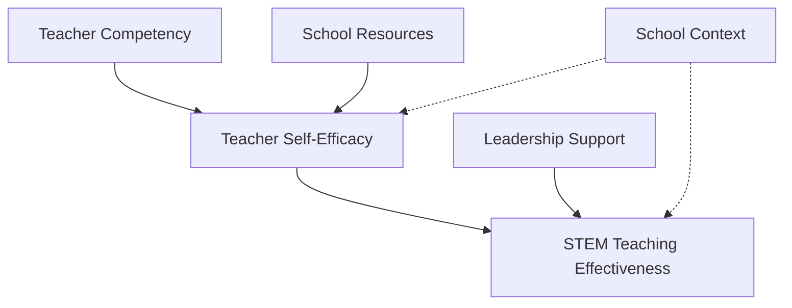
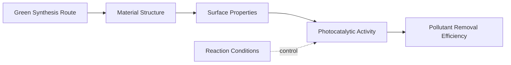

# Chương 5: Xây Dựng Khung Lý Thuyết & Giả Thuyết


---

> *"There is nothing so practical as a good theory." — Kurt Lewin*

---

Sau khi đi qua tổng quan tài liệu, nhiều người có cảm giác rằng mình đã "gần xong phần nền". Họ đã có một danh sách paper, một ma trận literature, vài theme lớn, và thậm chí một số research gap nghe rất thuyết phục. Nhưng ở thời điểm này, nghiên cứu vẫn chưa thật sự đứng vững. Nó mới giống một đống vật liệu đã được tập hợp lại, chưa phải một công trình có kết cấu.

Khung lý thuyết chính là thứ biến một tập hợp tài liệu thành một lập luận nghiên cứu. Nó trả lời những câu hỏi mà một literature review đơn thuần chưa thể trả lời:

- bạn đang nhìn vấn đề qua lăng kính nào
- tại sao những yếu tố này lại liên quan đến nhau
- vì sao câu hỏi của bạn đáng được đặt ra theo cách này chứ không phải cách khác
- dữ liệu nào cần thu, biến nào cần đo, hay trải nghiệm nào cần khám phá
- khi kết quả xuất hiện, bạn sẽ diễn giải nó dựa trên logic nào

Nói cách khác, literature review cho bạn biết *người khác đã nói gì*; khung lý thuyết giúp bạn quyết định *mình sẽ nghĩ bằng logic nào*. Nếu chương 4 là bước đọc thế giới học thuật, thì chương 5 là bước chọn bộ khung để bạn đứng vào đó và nhìn thế giới ấy một cách có phương pháp.

Đây cũng là nơi AI vừa rất hữu ích, vừa rất dễ bị lạm dụng. AI có thể giúp bạn tìm lý thuyết, so sánh khung khái niệm, gợi ý biến và vẽ sơ đồ rất nhanh. Nhưng nếu bạn để AI "chọn hộ" lăng kính lý thuyết chỉ vì nó nghe hợp lý hoặc phổ biến, bạn sẽ rơi vào một tình huống nguy hiểm: có framework, nhưng không thật sự hiểu tại sao framework đó là của mình.

Vì vậy, mục tiêu của chương này không phải là giúp bạn có một sơ đồ đẹp. Mục tiêu là giúp bạn xây một khung đủ rõ để đi tiếp sang thiết kế nghiên cứu, đủ chặt để phát biểu giả thuyết hoặc propositions, và đủ vững để bảo vệ trước GVHD, hội đồng hay reviewer.

## 5.1 Khung Lý Thuyết Không Phải Trang Trí Học Thuật

Một lỗi rất phổ biến trong luận văn và bài báo là xem khung lý thuyết như một phần bắt buộc phải có, nhưng chỉ để "điền vào". Hệ quả là chương lý thuyết trở thành nơi người viết:

- liệt kê vài lý thuyết nổi tiếng
- tóm tắt định nghĩa của từng lý thuyết
- chọn một lý thuyết vì nó phổ biến trong lĩnh vực
- vẽ sơ đồ các mũi tên giữa các biến
- rồi chuyển sang phương pháp mà không thật sự dùng khung đó để ra quyết định

Khi đó, khung lý thuyết chỉ là đồ trang trí học thuật. Nó có mặt, nhưng không làm việc.

Một khung tốt phải làm được ít nhất bốn việc:

### 1. Đặt câu hỏi nghiên cứu vào một logic giải thích

Khung lý thuyết không chỉ nói "có những yếu tố nào", mà giải thích vì sao những yếu tố đó có thể liên quan đến nhau. Ví dụ, trong nghiên cứu giáo dục STEM, bạn không chỉ nói giáo viên, tài nguyên và chính sách đều quan trọng. Bạn cần một logic để giải thích:

- tại sao năng lực giáo viên có thể ảnh hưởng đến hiệu quả dạy học
- liệu tác động đó là trực tiếp hay thông qua self-efficacy
- tại sao cùng một chính sách nhưng ở bối cảnh nông thôn và thành thị có thể tạo hiệu ứng khác nhau

### 2. Giới hạn phạm vi nghiên cứu

Khung tốt giúp bạn không ôm quá nhiều thứ. Một đề tài nghiên cứu luôn có thể kéo thêm rất nhiều biến, rất nhiều yếu tố nền, rất nhiều giải thích thay thế. Khung lý thuyết buộc bạn phải chọn:

- điều gì nằm trong phạm vi
- điều gì là bối cảnh
- điều gì chỉ nên thừa nhận là khả năng thay thế

### 3. Nối literature review với thiết kế nghiên cứu

Khi chương lý thuyết được làm đúng, nó dẫn thẳng sang các quyết định ở các chương sau:

- nghiên cứu này thiên về định lượng, định tính hay hỗn hợp
- cần đo construct nào và bằng biến nào
- cần phỏng vấn để hiểu trải nghiệm nào
- giả thuyết nào có thể kiểm định
- propositions nào nên giữ mở

### 4. Tạo nền cho diễn giải kết quả

Một kết quả không tự nói lên ý nghĩa của nó. Nó chỉ có ý nghĩa khi được diễn giải trong một logic nhất định. Nếu bạn không có khung lý thuyết rõ, phần Discussion sau này rất dễ trở thành:

- lặp lại kết quả
- kể tên vài nghiên cứu giống hoặc khác
- đưa ra kết luận khá tùy hứng

Nói ngắn gọn: **khung lý thuyết không chỉ thuộc chương 5; nó là cấu trúc ngầm chi phối cả chương 6 đến chương 14**.

## 5.2 Phân Biệt Theoretical, Conceptual Và Analytical Framework

Ba khái niệm này thường bị dùng lẫn nhau. Trong thực tế, chúng có liên quan nhưng không giống nhau.

| Loại | Câu hỏi chính | Khi nào dùng | Ví dụ |
|------|---------------|--------------|-------|
| **Theoretical framework** | Tôi dựa trên lý thuyết nào đã có sẵn? | Khi có một hoặc vài lý thuyết đủ mạnh để giải thích hiện tượng | TAM, Diffusion of Innovation, Self-Management Theory |
| **Conceptual framework** | Tôi tổng hợp các khái niệm và mối quan hệ nào từ literature để giải thích vấn đề của mình? | Khi không có một lý thuyết đơn lẻ nào đủ bao quát hoặc bạn cần tích hợp nhiều nguồn | Mô hình các yếu tố ảnh hưởng đến hiệu quả dạy STEM tại ĐBSCL |
| **Analytical framework** | Tôi sẽ dùng khung nào để đọc, phân loại, hoặc phân tích dữ liệu? | Khi cần một lăng kính phân tích dữ liệu hoặc chính sách | SWOT, PESTEL, Bloom's Taxonomy, policy analysis framework |

### Theoretical framework

Đây là trường hợp bạn mượn một bộ khái niệm và quan hệ đã được lý thuyết hóa tương đối đầy đủ. Điểm mạnh của cách này là:

- có nền học thuật rõ
- dễ kết nối với literature quốc tế
- dễ phát biểu giả thuyết hoặc vị trí nghiên cứu

Điểm yếu là:

- dễ dùng máy móc
- dễ ép dữ liệu vào khuôn có sẵn
- có thể không phù hợp với bối cảnh địa phương

### Conceptual framework

Đây là trường hợp bạn xây một mô hình làm việc dựa trên việc tổng hợp nhiều nghiên cứu, nhiều khái niệm, nhiều phát hiện. Nó rất hữu ích khi:

- lĩnh vực còn mới hoặc phân mảnh
- bối cảnh nghiên cứu có tính đặc thù cao
- một lý thuyết đơn lẻ không giải thích đủ hiện tượng

Điểm mạnh của conceptual framework là linh hoạt. Nhưng chính vì linh hoạt nên nó dễ trở nên lỏng nếu bạn không chỉ ra được:

- vì sao chọn các thành phần đó
- logic nào nối chúng với nhau
- nguồn literature nào chống lưng cho từng mối quan hệ

### Analytical framework

Khung phân tích không nhất thiết là lý thuyết về bản thân hiện tượng. Nhiều khi nó chỉ là công cụ để đọc dữ liệu hay cấu trúc hóa việc phân tích. Ví dụ:

- dùng Bloom's Taxonomy để phân loại dạng nhiệm vụ học tập
- dùng policy cycle framework để phân tích văn bản chính sách
- dùng thematic domains để tổ chức interview data

Điểm quan trọng là: **một nghiên cứu có thể đồng thời có theoretical framework và analytical framework**, nhưng bạn phải nói rõ mỗi cái làm việc gì.

## 5.3 Sai Lầm Phổ Biến Khi Xây Khung Lý Thuyết

### Sai lầm 1: Chọn lý thuyết vì nó nổi tiếng

Nhiều người chọn TAM, TPB, DOI, TPACK, hay một khung rất quen trong ngành chỉ vì "người ta hay dùng". Đây là logic nguy hiểm. Một lý thuyết nổi tiếng không tự động là lý thuyết phù hợp.

Điều bạn cần hỏi là:

- nó giải thích hiện tượng của tôi hay chỉ giải thích một phần
- nó hoạt động ở cấp độ cá nhân, tổ chức hay hệ thống
- nó có hợp với loại dữ liệu tôi sẽ thu không
- nó có làm mờ những yếu tố bối cảnh mà tôi đang quan tâm không

### Sai lầm 2: Kể tên quá nhiều lý thuyết nhưng không chọn lăng kính chính

Một số bản thảo dành nhiều trang để giới thiệu 4-5 lý thuyết, rồi cuối cùng không rõ nghiên cứu thực sự đứng trên nền nào. Việc này tạo cảm giác người viết "biết nhiều", nhưng lại làm lập luận bị phân tán.

Một chương lý thuyết mạnh không phải chương có nhiều tên lý thuyết nhất. Nó là chương biết:

- lý thuyết nào là trung tâm
- lý thuyết nào chỉ bổ trợ
- lý thuyết nào được nêu ra để phản biện hoặc loại trừ

### Sai lầm 3: Biến conceptual framework thành danh sách biến

Một sơ đồ có nhiều ô và nhiều mũi tên chưa chắc đã là framework. Nếu bạn chỉ gom các yếu tố literature từng nhắc tới rồi nối mũi tên giữa chúng, bạn đang có một danh sách trực quan, chưa chắc có logic.

Framework chỉ thực sự bắt đầu khi bạn nói rõ:

- mối quan hệ nào là cơ chế chính
- mối quan hệ nào là điều kiện nền
- yếu tố nào đóng vai trò trung gian, điều tiết, kiểm soát, hay bối cảnh

### Sai lầm 4: Dùng ngôn ngữ lý thuyết nhưng không nối với phương pháp

Đây là lỗi khiến chương lý thuyết bị tách rời khỏi phần còn lại của luận văn. Bạn có thể viết rất hay về constructs, mechanisms, assumptions, nhưng nếu sang chương phương pháp không biết:

- đo cái gì
- hỏi ai
- phân tích theo logic nào

thì chương lý thuyết vẫn chưa làm xong việc của nó.

### Sai lầm 5: Để AI chọn framework thay bạn

AI rất giỏi trong việc đưa ra danh sách "Top 5 theories commonly used in...". Nhưng đó chỉ là điểm khởi đầu. Nếu bạn copy gợi ý của AI mà không tự đọc nguồn gốc và tự cân nhắc độ phù hợp, bạn đang vay mượn một khung mà mình không sở hữu về mặt trí tuệ.

Quy tắc đơn giản là: **AI có thể giúp bạn mở rộng sân tìm kiếm, nhưng lựa chọn lý thuyết phải là quyết định học thuật của bạn**.

## 5.4 Tiêu Chí Chọn Một Khung Lý Thuyết Tốt

Khi đứng trước 3-5 lựa chọn tiềm năng, bạn có thể dùng năm tiêu chí sau để đánh giá.

### 1. Explanatory fit

Khung này có thực sự giải thích được hiện tượng bạn đang nghiên cứu không? Đừng chỉ hỏi nó có liên quan không; hãy hỏi nó có làm sáng tỏ cơ chế không.

Ví dụ:

- Nếu bạn nghiên cứu việc giáo viên có áp dụng STEM hay không, DOI có thể hữu ích vì nó nói về quá trình chấp nhận đổi mới.
- Nhưng nếu bạn nghiên cứu trải nghiệm dạy STEM trong điều kiện thiếu tài nguyên, một khung nhấn vào lived experience, agency hoặc organizational constraints có thể phù hợp hơn.

### 2. Level of analysis fit

Khung này vận hành ở cấp độ nào?

- cá nhân
- nhóm
- tổ chức
- hệ thống
- vật liệu/quá trình/cơ chế tự nhiên

Rất nhiều đề tài bị lệch vì chọn khung ở cấp độ cá nhân để giải thích vấn đề vốn nằm ở cấp độ tổ chức hoặc chính sách.

### 3. Context fit

Khung này có mang định kiến bối cảnh quá mạnh không? Nó có được phát triển trong môi trường rất khác với bối cảnh bạn đang nghiên cứu không? Nếu có, bạn có thể:

- dùng nhưng phải điều chỉnh
- dùng như điểm tham chiếu chứ không như chân lý
- hoặc chọn khung khác phù hợp hơn

Đây là điểm đặc biệt quan trọng trong nghiên cứu tại Việt Nam, nơi nhiều lý thuyết nhập từ bối cảnh phương Tây có thể bỏ qua:

- cấu trúc thể chế khác
- nguồn lực khác
- quan hệ quyền lực khác
- văn hóa nghề nghiệp và giáo dục khác

### 4. Method fit

Khung này có ăn nhập với loại dữ liệu và phương pháp bạn sẽ dùng không?

- Một lý thuyết giàu construct rõ ràng có thể rất phù hợp cho nghiên cứu định lượng.
- Một khung thiên về nghĩa, trải nghiệm và bối cảnh có thể phù hợp hơn cho định tính.
- Một conceptual framework tích hợp nhiều lớp có thể thích hợp cho mixed methods.

### 5. Parsimony và usability

Khung tốt không phải khung to nhất. Nó là khung đủ để giải thích vấn đề mà không kéo theo quá nhiều thành phần không cần thiết. Nếu framework của bạn có 12 biến, 4 mediator, 5 moderator và 8 control variables chỉ vì AI gợi ý được hết, khả năng cao bạn đang xây thứ khó làm, khó đo và khó bảo vệ.

Một framework usable là framework mà sau khi vẽ xong, bạn có thể trả lời ngay:

- tôi sẽ đo gì
- tôi sẽ hỏi gì
- tôi sẽ phân tích gì
- tôi mong chờ loại phát hiện nào

## 5.5 Từ Literature Review Sang Problem Logic

Chương 4 giúp bạn tìm được theme, gap và vị trí nghiên cứu. Nhưng trước khi chọn theory hay dựng framework, bạn cần làm thêm một bước rất quan trọng: biến literature gap thành **problem logic**.

Problem logic là câu trả lời ngắn gọn cho bốn câu hỏi:

- hiện tượng nào đang đáng quan tâm
- vấn đề cốt lõi nằm ở đâu
- ta tin cơ chế nào đang vận hành
- nghiên cứu này sẽ đóng góp bằng cách làm sáng tỏ điều gì

Ví dụ xã hội học/giáo dục:

- **Hiện tượng:** giáo dục STEM được khuyến khích rộng rãi nhưng hiệu quả triển khai không đồng đều.
- **Vấn đề:** nhiều nghiên cứu nói đến rào cản, nhưng chưa chỉ ra rõ cơ chế nối từ điều kiện nhà trường, năng lực giáo viên và tự tin nghề nghiệp đến hiệu quả dạy học trong bối cảnh tỉnh lẻ.
- **Cơ chế nghi ngờ:** teacher competency và school resources không chỉ tác động trực tiếp, mà còn đi qua self-efficacy và bị điều tiết bởi bối cảnh trường.
- **Đóng góp:** xây một framework phù hợp hơn với bối cảnh ĐBSCL.

Ví dụ STEM/kỹ thuật:

- **Hiện tượng:** nano-photocatalysis cho xử lý nước thải cho kết quả lab rất hứa hẹn.
- **Vấn đề:** literature tập trung mạnh vào hiệu suất trong điều kiện tối ưu, nhưng ít nghiên cứu nối từ vật liệu, phương pháp tổng hợp, đặc tính bề mặt đến hiệu quả và tính khả thi ở điều kiện gần thực tế hơn.
- **Cơ chế nghi ngờ:** green synthesis ảnh hưởng cấu trúc vật liệu, cấu trúc này ảnh hưởng khả năng hấp thụ và hoạt tính quang xúc tác, từ đó mới tác động đến hiệu quả xử lý.
- **Đóng góp:** thiết kế một conceptual/mechanistic framework nối từ input vật liệu đến output xử lý trong bối cảnh ứng dụng.

Khi problem logic rõ, việc chọn framework sẽ dễ hơn rất nhiều, vì bạn không còn hỏi "lý thuyết nào nổi tiếng", mà hỏi "**khung nào giúp tôi giải thích logic này tốt nhất**".

## 5.6 Workflow Dùng Antigravity Để Tìm Và So Sánh Lý Thuyết

AI mạnh nhất ở giai đoạn này không phải vì nó "nghĩ hộ" bạn, mà vì nó giúp bạn soát phạm vi rộng nhanh hơn và so sánh các lựa chọn có hệ thống hơn.

### Bước 1: Liệt kê các khung được dùng phổ biến trong lĩnh vực

Ở bước này, bạn có thể dùng Perplexity Research hoặc một công cụ tìm literature có grounding tốt.

> 📋 **Prompt Template — Theory Discovery**
> ```text
> Tôi đang nghiên cứu về [topic]. Research question sơ bộ là: [RQ].
>
> Hãy giúp tôi xác định các theoretical framework, conceptual
> framework, hoặc analytical framework thường được dùng trong
> nghiên cứu về chủ đề này.
>
> Với mỗi framework, cho biết:
> - tác giả hoặc nguồn gốc chính
> - hiện tượng/framework này giải thích điều gì
> - cấp độ phân tích (cá nhân/tổ chức/hệ thống/cơ chế tự nhiên)
> - strengths
> - limitations
> - loại nghiên cứu thường sử dụng nó
>
> Không chọn hộ tôi framework tốt nhất ngay. Mục tiêu trước tiên
> là tạo landscape các lựa chọn.
> ```

Điểm quan trọng của prompt này là không để AI nhảy thẳng vào việc "recommend best theory". Trước tiên, bạn cần một bản đồ lựa chọn.

### Bước 2: Truy về nguồn gốc của 2-3 khung tiềm năng nhất

Đây là chỗ nhiều người bỏ qua và cũng là nơi chất lượng học thuật bắt đầu tách ra. Bạn không nên chỉ dựa vào summary của AI về một lý thuyết. Hãy truy về:

- sách gốc hoặc paper gốc của lý thuyết
- các review paper tổng hợp việc sử dụng lý thuyết đó trong lĩnh vực
- các nghiên cứu gần với bối cảnh của bạn

> 📋 **Prompt Template — Source Trace**
> ```text
> Với framework [X], hãy tìm:
> - nguồn gốc lý thuyết quan trọng nhất
> - 3-5 nghiên cứu tiêu biểu ứng dụng framework này trong chủ đề [topic]
> - 2-3 bài phê bình hoặc chỉ ra hạn chế của framework
>
> Trình bày rõ nguồn nào là primary source, nguồn nào là ứng dụng.
> ```

### Bước 3: Lập theory fit matrix

Đây là bước mình khuyên gần như chương nào cũng nên có khi làm nghiên cứu nghiêm túc. Bạn không chọn theory bằng trực giác đơn thuần; bạn so sánh nó bằng một ma trận tiêu chí.

Ví dụ:

| Tiêu chí | Framework A | Framework B | Framework C |
|----------|-------------|-------------|-------------|
| Giải thích hiện tượng cốt lõi | Cao | Trung bình | Cao |
| Phù hợp cấp độ phân tích | Trung bình | Cao | Trung bình |
| Hợp với bối cảnh Việt Nam | Thấp | Trung bình | Cao |
| Hợp với phương pháp dự định | Cao | Cao | Trung bình |
| Dễ chuyển thành biến / propositions | Cao | Trung bình | Trung bình |
| Rủi ro bỏ sót yếu tố bối cảnh | Cao | Thấp | Trung bình |

> 📋 **Prompt Template — Theory Fit Matrix**
> ```text
> Dựa trên research question của tôi, hãy tạo một theory fit
> matrix để so sánh 3 framework sau: [A], [B], [C].
>
> Tiêu chí gồm:
> - explanatory fit
> - level of analysis fit
> - context fit
> - method fit
> - ease of operationalization
> - major limitations
>
> Chỉ ra trade-off của từng framework, không kết luận thay tôi.
> ```

### Bước 4: Dùng Sequential Thinking để ép mình chọn

Sau khi có fit matrix, hãy yêu cầu Antigravity đóng vai một người phản biện khó tính chứ không phải trợ lý chiều ý bạn.

> 📋 **Prompt Template — Forced Choice**
> ```text
> Sử dụng Sequential Thinking, hãy giúp tôi ra quyết định giữa
> các framework [A], [B], [C] cho nghiên cứu sau: [mô tả ngắn].
>
> Tôi muốn anh/chị:
> - chỉ ra framework nào phù hợp nhất với problem logic
> - framework nào chỉ nên dùng bổ trợ
> - framework nào nên loại bỏ và vì sao
> - rủi ro nếu tôi chọn framework phổ biến nhất nhưng không hợp nhất
>
> Hãy phản biện mạnh tay, không nể nang.
> ```

Mục tiêu của bước này không phải để AI tuyên bố thay bạn. Mục tiêu là ép bạn nhìn rõ trade-off.

## 5.7 Hai Ví Dụ Song Hành: STEM Và Khoa Học Xã Hội

### Ví dụ 1: Giáo dục STEM ở ĐBSCL

Giả sử bạn đang nghiên cứu câu hỏi:

> Những yếu tố nào ảnh hưởng đến hiệu quả triển khai giáo dục STEM ở các trường THPT tại Đồng bằng sông Cửu Long?

Sau literature review, bạn thấy ba hướng lớn:

- hướng nhấn vào adoption of innovation
- hướng nhấn vào teacher knowledge/capability
- hướng nhấn vào bối cảnh tổ chức và nguồn lực

Ba framework có thể xuất hiện:

- Diffusion of Innovation
- TPACK
- một conceptual framework tích hợp teacher competency, school resources, policy support và self-efficacy

Nếu mục tiêu của bạn là giải thích *quá trình chấp nhận đổi mới*, DOI có thể rất hữu ích. Nhưng nếu bạn quan tâm nhiều hơn đến *hiệu quả triển khai trong bối cảnh nhà trường cụ thể*, một khung tích hợp giữa competency, self-efficacy và organizational support có thể phù hợp hơn. Lúc này, DOI có thể chỉ đóng vai trò nền tham chiếu, không phải khung trung tâm.

### Ví dụ 2: Nano-composite TiO2/rGO cho xử lý nước thải

Giả sử câu hỏi của bạn là:

> Green-synthesized TiO2/rGO nano-composite có cải thiện hiệu quả quang xúc tác trong xử lý nước thải dệt nhuộm hay không, và thông qua những đặc tính vật liệu nào?

Ở đây, nếu bạn bê nguyên cách nghĩ "chọn một theory nổi tiếng" từ khoa học xã hội sang sẽ bị lệch. Trong nhiều đề tài kỹ thuật và khoa học tự nhiên, framework không phải luôn là một "theory" theo nghĩa kinh điển. Nó có thể là một mechanistic framework gồm:

- thành phần đầu vào của vật liệu
- quy trình tổng hợp
- đặc tính bề mặt/cấu trúc
- điều kiện phản ứng
- các chỉ số đầu ra

Lúc này, conceptual framework của bạn có thể được xây bằng cách tổng hợp:

- lý thuyết về band gap và charge separation
- nguyên lý photocatalysis
- findings về vai trò của graphene trong tăng diện tích bề mặt và giảm recombination

Khung ở đây phải trả lời:

- yếu tố vật liệu nào là trung tâm
- cơ chế nào được giả định
- đầu ra nào phản ánh tốt nhất hiệu quả xử lý
- điều kiện thí nghiệm nào là nền hay biến kiểm soát

Hai ví dụ này cho thấy một điều quan trọng: **khung lý thuyết tốt không có hình thức cố định cho mọi ngành, nhưng luôn phải làm rõ logic giải thích của đề tài**.

## 5.8 Tự Xây Conceptual Framework Từ Literature

Khi không có một lý thuyết sẵn đủ khớp, bạn sẽ phải xây conceptual framework của riêng mình. Việc này không có nghĩa là "bịa ra một sơ đồ". Nó là một quá trình tổng hợp có kỷ luật.

### Bước 1: Lập inventory các khái niệm xuất hiện lặp lại

Từ literature matrix ở chương 4, hãy đánh dấu:

- construct nào xuất hiện nhiều lần
- yếu tố nào thường được nhắc như nguyên nhân
- yếu tố nào thường được nhắc như kết quả
- yếu tố nào xuất hiện như điều kiện bối cảnh

Ví dụ trong nghiên cứu giáo dục:

- teacher competency
- school resources
- leadership support
- self-efficacy
- implementation quality

Ví dụ trong nghiên cứu vật liệu:

- synthesis route
- morphology
- crystallinity
- surface area
- degradation efficiency
- operating conditions

### Bước 2: Nhóm các khái niệm theo vai trò

Đừng nối mũi tên ngay. Trước hết hãy nhóm chúng thành:

- hiện tượng đầu ra cần giải thích
- yếu tố tiền đề
- cơ chế trung gian
- yếu tố điều kiện hoặc bối cảnh
- yếu tố kiểm soát

Chính bước này giúp bạn tránh việc framework trở thành một mạng lưới rối rắm.

### Bước 3: Viết bằng câu trước khi vẽ bằng sơ đồ

Đây là một nguyên tắc rất hữu ích: **nếu bạn chưa thể diễn đạt framework của mình bằng 4-6 câu logic, bạn chưa sẵn sàng để vẽ nó**.

Ví dụ:

- Năng lực giáo viên và nguồn lực nhà trường dự kiến ảnh hưởng đến hiệu quả dạy STEM.
- Tác động này có thể diễn ra một phần thông qua self-efficacy của giáo viên.
- Bối cảnh trường học có thể làm mạnh hoặc yếu đi những tác động này.

Hoặc:

- Phương pháp tổng hợp xanh ảnh hưởng đến cấu trúc và đặc tính bề mặt của nano-composite.
- Những đặc tính này tác động đến hoạt tính quang xúc tác.
- Điều kiện phản ứng là yếu tố nền cần kiểm soát khi đánh giá hiệu quả xử lý.

Nếu viết bằng câu đã rõ, sơ đồ sẽ rõ. Nếu viết bằng câu vẫn mơ hồ, sơ đồ chỉ làm mơ hồ đẹp hơn.

### Bước 4: Chỉ ra bằng chứng chống lưng cho từng mối quan hệ

Mỗi mũi tên nên có lý do tồn tại. Lý do đó có thể đến từ:

- một lý thuyết đã có
- một nhóm nghiên cứu thực nghiệm nhất quán
- một cơ chế được literature xác lập

Nếu có mũi tên nào chỉ vì "nghe hợp lý", đó là điểm cần xem lại.

### Bước 5: Ghi rõ phần nào còn mở

Không phải framework nào cũng phải chốt kín mọi quan hệ. Đặc biệt trong định tính và mixed methods, bạn có thể để một số phần mở như:

- sensitizing concepts
- preliminary propositions
- working assumptions

Điều này giúp framework đủ định hướng mà không giết chết khả năng khám phá.

## 5.9 Dùng Antigravity Để Dựng Và Stress-Test Conceptual Framework

Sau khi bạn đã tự làm rõ problem logic, AI có thể giúp rất mạnh ở giai đoạn tinh chỉnh.

> 📋 **Prompt Template — Framework Builder**
> ```text
> Tôi đang xây conceptual framework cho nghiên cứu sau:
> - Research question: [RQ]
> - Bối cảnh: [context]
> - Hiện tượng cần giải thích: [outcome/phenomenon]
> - Các yếu tố literature thường nhắc đến:
>   - [factor 1] theo [author/year]
>   - [factor 2] theo [author/year]
>   - [factor 3] theo [author/year]
>
> Hãy giúp tôi:
> 1. nhóm các yếu tố theo vai trò: antecedents, mechanism,
>    moderators/context, outcomes
> 2. chỉ ra mối quan hệ nào có bằng chứng mạnh, mối quan hệ nào
>    còn yếu
> 3. đề xuất một conceptual framework sơ bộ
> 4. chỉ ra những điểm có nguy cơ quá tải hoặc chồng lắp
> ```

Một prompt như vậy tốt hơn nhiều so với câu lệnh "hãy vẽ framework cho tôi", vì nó ép AI làm công việc hỗ trợ phân tích thay vì trình diễn.

Sau đó, bạn có thể nhờ AI chuyển logic đó thành Mermaid diagram:



Hoặc với khung cơ chế trong nghiên cứu vật liệu:



Điểm quan trọng không nằm ở việc có Mermaid hay không. Nó nằm ở việc sơ đồ đó có phản ánh một logic bạn hiểu và có thể bảo vệ hay không.

## 5.10 Từ Framework Sang Nghiên Cứu Định Lượng

Đây là chỗ chương này phải nối thật chắc sang chương 6.

Khi làm định lượng, framework của bạn cần được dịch sang ngôn ngữ có thể đo được. Quá trình này đi theo chuỗi:

**construct -> variable -> indicator -> instrument -> hypothesis**

### Construct không phải variable

Đây là lỗi rất hay gặp. Construct là khái niệm trừu tượng:

- self-efficacy
- trust
- leadership support
- perceived usefulness

Variable là cách bạn đưa construct đó vào nghiên cứu dưới dạng có thể quan sát/đo lường. Ví dụ:

- self-efficacy được đo bằng thang Likert 5 mục
- leadership support được operationalize qua các chỉ báo về hỗ trợ tài chính, thời gian, chính sách

Nếu khung lý thuyết của bạn chỉ dừng ở mức construct mà không thể đi xuống variable, chương phương pháp sẽ bị khựng.

### Các câu hỏi bắt buộc trước khi phát biểu giả thuyết

- Mối quan hệ này là trực tiếp hay gián tiếp?
- Tôi có lý do học thuật để dự báo chiều tác động hay không?
- Có biến nền nào cần kiểm soát?
- Có yếu tố điều tiết nào cần cân nhắc?
- Thiết kế và cỡ mẫu của tôi có đủ để kiểm định mức phức tạp này không?

### Ví dụ: từ framework sang giả thuyết

Giả sử framework của bạn nói:

- teacher competency ảnh hưởng đến STEM teaching effectiveness
- tác động này đi qua teacher self-efficacy
- school context điều tiết cường độ tác động

Bạn có thể đi tới:

- **H1:** Teacher competency has a positive association with STEM teaching effectiveness.
- **H2:** Teacher self-efficacy mediates the relationship between teacher competency and STEM teaching effectiveness.
- **H3:** The relationship between teacher competency and STEM teaching effectiveness varies by school context.

Điểm quan trọng là giả thuyết không được sinh ra từ hư không. Nó là bản dịch có cấu trúc của framework.

> 📋 **Prompt Template — Hypothesis Builder**
> ```text
> Dựa trên framework sau, hãy giúp tôi chuyển từ construct
> sang bộ giả thuyết có thể kiểm định.
>
> Với mỗi mối quan hệ, cho biết:
> - loại quan hệ: direct / mediation / moderation / control
> - nên phát biểu directional hay non-directional
> - cần bằng chứng literature nào để chống lưng
> - rủi ro nếu giả thuyết đang đi quá xa dữ liệu hoặc lý thuyết
> ```

Một AI tốt sẽ giúp bạn cấu trúc hóa việc nghĩ. Nhưng bạn vẫn phải là người quyết định mối quan hệ nào đáng giữ, mối quan hệ nào nên loại bỏ để mô hình còn khả thi.

## 5.11 Từ Framework Sang Nghiên Cứu Định Tính

Nghiên cứu định tính không vận hành theo logic "biến và kiểm định" giống định lượng, nhưng nó vẫn cần khung lý thuyết. Khác biệt nằm ở cách dùng.

### Khung trong định tính là định hướng, không phải lồng sắt

Trong định tính, framework thường giúp bạn:

- chọn góc nhìn để đọc hiện tượng
- quyết định nên chú ý tới loại trải nghiệm nào
- phát triển sensitizing concepts ban đầu
- tổ chức câu hỏi phỏng vấn hoặc phân tích tài liệu

Nhưng nếu dùng quá cứng, framework có thể bóp chết khả năng khám phá. Dữ liệu định tính thường mạnh nhất khi nó có thể làm bạn sửa lại khung ban đầu chứ không chỉ xác nhận nó.

### Sensitizing concepts thay vì giả thuyết đóng

Ví dụ, trong một case study về triển khai STEM ở ĐBSCL, bạn có thể đi vào nghiên cứu với các sensitizing concepts như:

- perceived support
- professional identity
- resource constraint
- adaptive agency

Những khái niệm này giúp bạn chú ý đến một số mẫu trong dữ liệu, nhưng không ép người tham gia phải nói theo đúng những nhãn đó.

### Propositions khi nào hữu ích?

Trong case study hoặc một số thiết kế định tính định hướng hơn, bạn có thể viết propositions sơ bộ. Chúng không phải giả thuyết để kiểm định, mà là phát biểu làm việc giúp giữ sự tập trung.

Ví dụ:

- Giáo viên có xu hướng diễn giải thiếu tài nguyên không chỉ như rào cản vật chất mà còn như chỉ dấu của vị thế nghề nghiệp.
- Sự hỗ trợ của ban giám hiệu ảnh hưởng đến cảm nhận khả thi của việc dạy STEM.

Các propositions này tốt khi chúng đủ rõ để định hướng, nhưng đủ mở để dữ liệu phản biện lại.

> 📋 **Prompt Template — Sensitizing Concepts**
> ```text
> Cho nghiên cứu định tính sau:
> - Research question: [RQ]
> - Approach: [phenomenology / grounded theory / case study]
> - Literature suggests these recurrent ideas: [list]
>
> Hãy giúp tôi:
> - đề xuất 4-6 sensitizing concepts ban đầu
> - chỉ ra khái niệm nào nên giữ mở
> - gợi ý các câu hỏi phỏng vấn có thể nối với từng khái niệm
> - cảnh báo nguy cơ tôi đang áp đặt literature lên dữ liệu
> ```

## 5.12 Từ Framework Sang Nghiên Cứu Hỗn Hợp

Với mixed methods, khung lý thuyết còn làm thêm một việc nữa: nó phải giúp bạn nối hai nhánh dữ liệu với nhau.

Ví dụ:

- nhánh định lượng đo teacher competency, self-efficacy và effectiveness
- nhánh định tính khám phá giáo viên trải nghiệm self-efficacy và resource constraint ra sao

Framework lúc này không chỉ nói "có những yếu tố nào", mà còn chỉ ra:

- phần nào thích hợp để đo
- phần nào thích hợp để khám phá sâu
- phần nào là điểm gặp nhau khi tích hợp kết quả

Một conceptual framework tốt cho mixed methods thường có:

- phần lõi chung làm xương sống
- phần định lượng hóa được
- phần bối cảnh/ý nghĩa hóa cần định tính làm rõ

Điều này sẽ nối trực tiếp sang chương 8, nơi bạn cần logic tích hợp giữa hai nhánh chứ không chỉ chạy song song.

## 5.13 Kiểm Tra Logic Của Framework Trước Khi Đi Tiếp

Trước khi chuyển sang chương thiết kế, bạn nên làm một vòng stress test rất nghiêm túc. Hãy hỏi:

### 1. Framework này có trả lời đúng research question không?

Nhiều người có một framework tốt, nhưng nó trả lời một câu hỏi khác với câu hỏi họ đã tuyên bố.

### 2. Có mắt xích logic nào đang thiếu không?

Ví dụ, bạn dự đoán A ảnh hưởng B, nhưng literature thực ra luôn đi qua một cơ chế trung gian C mà bạn chưa tính tới.

### 3. Có đang quá tham không?

Một framework quá nhiều thành phần thường là dấu hiệu bạn chưa thật sự chọn cái gì là trọng tâm.

### 4. Có biến/khái niệm nào chỉ xuất hiện vì AI gợi ý chứ không có vai trò thật trong problem logic không?

Nếu có, loại nó ra.

### 5. Nếu reviewer hỏi "vì sao lại chọn khung này mà không chọn khung kia?", bạn có trả lời được không?

Nếu chưa, quay lại fit matrix.

> 📋 **Prompt Template — Framework Stress Test**
> ```text
> Đây là conceptual/theoretical framework hiện tại của tôi:
> [mô tả ngắn hoặc sơ đồ]
>
> Hãy đóng vai reviewer khó tính và đánh giá:
> - framework này có điểm mạnh gì
> - đâu là 3 điểm yếu lớn nhất
> - có missing mechanism nào không
> - có biến nào nên bỏ để framework chặt hơn
> - nếu nghiên cứu định lượng: giả thuyết nào đang quá sức
> - nếu nghiên cứu định tính: chỗ nào đang quá áp đặt
> ```

Prompt này đặc biệt hữu ích vì nó chuyển AI từ vai trò "đồng ý với bạn" sang vai trò phản biện.

## 5.14 Đạo Đức Và Giới Hạn Khi Dùng AI Cho Phần Lý Thuyết

Có ba rủi ro lớn khi dùng AI ở chương này.

### Rủi ro 1: Thiên kiến framework phổ biến

AI thường ưu tiên những framework được nhắc nhiều trong dữ liệu huấn luyện. Điều đó có thể làm bạn vô tình:

- ưu tiên lý thuyết phương Tây
- ưu tiên các khung mainstream
- bỏ qua bối cảnh địa phương hoặc literature ít được số hóa

### Rủi ro 2: Tạo cảm giác hiểu giả

AI có thể giải thích một theory rất mạch lạc. Nhưng việc đọc một summary hay không đồng nghĩa với việc bạn hiểu theory đủ sâu để dùng nó. Nếu bạn chưa đọc nguồn gốc hoặc ít nhất những paper ứng dụng quan trọng, cảm giác hiểu đó có thể là ảo giác.

### Rủi ro 3: Vẽ framework quá đẹp, quá gọn, quá chắc

Framework AI tạo thường rất sạch và rất cân xứng. Đời thật của nghiên cứu thì ít khi cân xứng như vậy. Một conceptual framework quá đẹp đôi khi là dấu hiệu nó đã bị làm phẳng mất những mâu thuẫn, ngoại lệ và vùng chưa chắc.

Vì vậy, nguyên tắc đạo đức của chương này là:

- AI giúp bạn mở rộng, không quyết định thay bạn
- mọi framework phải truy được về literature hoặc logic học thuật rõ ràng
- mọi khái niệm giữ lại phải là thứ bạn có thể tự giải thích

## 5.15 Workflow Hoàn Chỉnh Của Chương

Bạn có thể tóm gọn toàn bộ chương này thành workflow sau:

```text
Input:
- Research question sơ bộ
- Literature matrix từ Chương 4
- Các theme, gaps, và notes quan trọng

Step 1:
- Viết problem logic bằng 4 câu: hiện tượng, vấn đề, cơ chế nghi ngờ, đóng góp

Step 2:
- Dùng AI để lập bản đồ các framework có thể dùng

Step 3:
- Truy nguồn gốc và ứng dụng của 2-3 framework tiềm năng

Step 4:
- Lập theory fit matrix và chọn khung trung tâm

Step 5:
- Nếu không có khung sẵn đủ khớp, tự xây conceptual framework từ literature

Step 6:
- Viết framework bằng câu trước khi vẽ sơ đồ

Step 7:
- Dịch framework sang:
  - variables + hypotheses nếu định lượng
  - sensitizing concepts / propositions nếu định tính
  - points of integration nếu hỗn hợp

Step 8:
- Stress-test framework bằng phản biện và kiểm tra logic

Output:
- A justified framework
- Một sơ đồ rõ
- Bộ hypotheses hoặc propositions ban đầu
- Cầu nối trực tiếp sang chương thiết kế nghiên cứu
```

## 5.16 Bài Tập Thực Hành

### Hands-on 5.1: Theory Fit Matrix

Chọn 3 framework tiềm năng cho đề tài của bạn và tạo một bảng so sánh theo các tiêu chí:

- explanatory fit
- level of analysis fit
- context fit
- method fit
- limitations

Sau đó viết 150-200 từ giải thích vì sao bạn chọn khung trung tâm.

### Hands-on 5.2: Problem Logic Statement

Viết một đoạn ngắn gồm đúng 4 câu:

- câu 1: hiện tượng
- câu 2: vấn đề
- câu 3: cơ chế hoặc logic cần làm rõ
- câu 4: đóng góp dự kiến

Nếu viết xong mà framework vẫn chưa tự lộ ra, quay lại literature review thay vì vội vẽ sơ đồ.

### Hands-on 5.3: Framework In Words, Then In Diagram

Viết framework của bạn bằng 4-6 câu logic. Chỉ sau đó mới yêu cầu Antigravity tạo Mermaid diagram. So sánh hai phiên bản:

- bản viết bằng câu có rõ hơn sơ đồ không
- sơ đồ có thêm mối quan hệ nào mà bản viết chưa thật sự chống lưng không

### Hands-on 5.4: Translate Framework Into Design

Với framework đã chọn, hãy tạo một trong ba sản phẩm sau:

- danh sách constructs -> variables -> indicators nếu bạn đi theo định lượng
- danh sách sensitizing concepts + câu hỏi phỏng vấn nếu bạn đi theo định tính
- bảng chỉ ra phần nào sẽ là dữ liệu định lượng, phần nào là dữ liệu định tính nếu bạn đi theo mixed methods

## Deliverable Cuối Chương

Sau khi hoàn thành chương này, bạn nên có:

- một `problem logic statement` dài 1 đoạn
- một `theory fit matrix` cho ít nhất 2-3 framework
- một `theoretical/conceptual framework` đã được giải thích bằng lời và thể hiện bằng sơ đồ
- một bộ `hypotheses`, `propositions`, hoặc `sensitizing concepts` ban đầu
- một cây cầu rõ ràng sang chương thiết kế nghiên cứu tiếp theo

Nếu bạn rời chương này mà chỉ có một sơ đồ đẹp, bạn vẫn chưa xong. Nếu bạn rời chương này với một khung mà bạn hiểu, tin, và có thể dùng để quyết định phương pháp, thì lúc đó chương lý thuyết mới thực sự hoàn thành nhiệm vụ của nó. Từ đây, dự án của bạn mới có thể rẽ sang thiết kế định lượng, định tính hoặc hỗn hợp mà không bị đứt logic giữa câu hỏi, framework và quyết định phương pháp.

---

> 📖 **Tiếp theo:** [Chương 6: Thiết Kế Nghiên Cứu Định Lượng →](../03-thiet-ke/chuong-06-dinh-luong.md)
