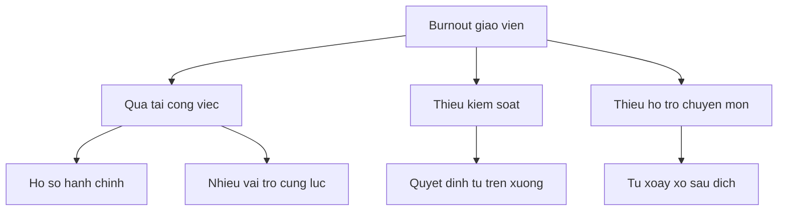

# Chương 11: Phân Tích Dữ Liệu Định Tính


---

> *"The purpose of qualitative research is to understand, not to predict."* — Merriam (2009)

---

Nếu phân tích định lượng thường hỏi “mối quan hệ này mạnh đến đâu?”, thì phân tích định tính thường hỏi “trải nghiệm này có ý nghĩa gì?”, “quá trình này vận hành thế nào?”, hoặc “người trong cuộc hiểu hiện tượng này ra sao?”. Chính vì vậy, phân tích định tính không thể bị thu gọn thành vài thao tác gắn code vào transcript. Nó là một quá trình đọc, đối thoại, diễn giải, và kiểm chứng ý nghĩa.

Đây cũng là nơi AI dễ bị dùng sai nhất. Một mô hình có thể tạo ra draft codes rất nhanh, nhóm chúng thành themes, vẽ thematic map, và thậm chí viết một đoạn findings nghe có vẻ rất học thuật. Nhưng nếu người nghiên cứu giao luôn phần đọc và phần diễn giải cho AI, nghiên cứu định tính sẽ mất đi điều quan trọng nhất: sự gắn bó có suy tư giữa nhà nghiên cứu và dữ liệu.

Vì vậy, chương này giữ một nguyên tắc xuyên suốt:

> AI có thể hỗ trợ phân tích định tính, nhưng không được thay thế hành vi đọc, suy nghĩ, và phán đoán diễn giải của nhà nghiên cứu.

Antigravity rất hữu ích ở giai đoạn này vì nó giúp bạn:

- chuyển audio thành transcript;
- làm sạch và tổ chức dữ liệu;
- tạo draft open codes;
- gợi ý nhóm categories;
- xây thematic map và triangulation matrix;
- rà coherence của findings và liên kết với các nguồn khác.

Nhưng mọi giá trị của công cụ chỉ có ý nghĩa nếu bạn giữ được vai trò trung tâm của mình như một người phân tích, không chỉ như người “duyệt output”.

Nếu `Chương 10` tập trung vào mức độ, khác biệt và mối quan hệ, thì chương này tập trung vào ý nghĩa, quá trình và trải nghiệm. Hai chương không đối đầu nhau; chúng đại diện cho hai cách xây bằng chứng khác nhau. Và cũng giống chương trước, phân tích ở đây sẽ mạnh nhất khi bạn bước vào nó với dữ liệu đã được chuẩn bị cẩn thận từ `Chương 9`, thay vì coi transcript hay tài liệu như những khối chữ có thể giao thẳng cho AI xử lý.

---

## 11.1 Phân Tích Định Tính Thực Chất Là Gì?

Phân tích định tính là quá trình tìm kiếm mẫu hình ý nghĩa trong dữ liệu phi cấu trúc hoặc bán cấu trúc như:

- phỏng vấn;
- focus group;
- field notes;
- nhật ký;
- tài liệu chính sách;
- bài đăng công khai;
- hoặc các nguồn tư liệu phức tạp khác.

### Điều định tính tìm kiếm không chỉ là "nội dung"

Nó còn tìm:

- cách người tham gia kể câu chuyện;
- sự mâu thuẫn trong trải nghiệm;
- các khung nghĩa lặp lại;
- quá trình diễn ra theo thời gian;
- và những trường hợp không khớp với pattern chung.

### Một phân tích định tính tốt thường phải làm được 4 việc

1. Bám sát dữ liệu đủ lâu để không nhảy quá nhanh lên lý thuyết.
2. Tạo ra hệ thống mã hóa có logic.
3. Phát triển themes hoặc categories có tính giải thích.
4. Chứng minh rằng diễn giải đó đáng tin, không phải chỉ là ấn tượng cá nhân.

### Một nguyên tắc cần nhớ

> Phân tích định tính không phải là tô màu transcript. Nó là xây dựng một lập luận diễn giải từ dữ liệu.

---

## 11.2 Chuẩn Bị Dữ Liệu: Transcript, Field Notes và Corpus Sạch

Rất nhiều vấn đề của phân tích định tính thực ra bắt đầu từ khâu chuẩn bị dữ liệu.

### Transcription không trung tính

Cách bạn chép lại lời nói đã là một phần của phân tích. Bạn quyết định:

- giữ hay bỏ khoảng dừng;
- có ghi tiếng cười, ngập ngừng, nhấn giọng không;
- có chuẩn hóa câu nói quá mạnh không;
- có sửa ngữ pháp cho “đẹp” không.

Mỗi quyết định như vậy đều ảnh hưởng đến cách dữ liệu được hiểu.

### Khi nào cần transcript chi tiết hơn?

- khi nghiên cứu quan tâm đến diễn ngôn, cảm xúc, hoặc sự do dự;
- khi cần phân tích tiến trình tương tác;
- khi cách nói quan trọng gần bằng nội dung nói.

### Khi nào transcript ở mức vừa đủ là ổn?

- khi mục tiêu chính là thematic analysis ở cấp ý nghĩa;
- khi bạn không phân tích conversation structure hay discourse details;
- khi cần giữ tốc độ và nguồn lực ở mức hợp lý.

### Mẫu thông tin nên có trong transcript

```markdown
Interview ID: P01
Date: 2026-04-10
Duration: 45:00
Context: Giáo viên THPT, trường công lập
Anonymization note: Tên trường và tên riêng đã được thay mã

[00:00] I: ...
[00:24] P01: ...
```

### Prompt cho transcription workflow

> 📋 **Prompt Template — Transcription Workflow**
> ```
> Tôi có file audio phỏng vấn tiếng Việt.
> 
> Hãy giúp tôi:
> 1. Transcribe audio
> 2. Gắn nhãn người nói
> 3. Giữ timestamps định kỳ
> 4. Ghi chú ngắn cho pauses/laughter/hesitation nếu liên quan
> 5. Tạo bản transcript sạch để phân tích
> 6. Nhắc tôi những chỗ cần kiểm tra tay vì dễ sai
> ```

### Đừng quên field notes

Nhiều nghiên cứu định tính yếu đi vì chỉ giữ transcript mà bỏ mất:

- bối cảnh buổi phỏng vấn;
- ngôn ngữ cơ thể;
- không khí cuộc gặp;
- những điều được quan sát nhưng không được nói ra trực tiếp.

Field notes không thay transcript, nhưng rất quan trọng để diễn giải.

---

## 11.3 Familiarization: Bước AI Không Nên Làm Thay Bạn

Trước khi coding, bạn phải đọc dữ liệu như một người đang cố hiểu một thế giới, không phải như một người chỉ cố chia đoạn thành nhãn.

### Familiarization gồm những gì?

- đọc toàn bộ transcript ít nhất một lượt;
- ghi ấn tượng ban đầu;
- đánh dấu những đoạn nổi bật;
- để ý sự lặp lại, mâu thuẫn, khoảng lặng, và từ khóa in-vivo;
- ghi memo sơ bộ về những hướng diễn giải có thể có.

### Vì sao bước này quan trọng?

Vì nếu bỏ qua, bạn sẽ rất dễ:

- code quá máy móc;
- chụp lấy những gì AI gợi ý sẵn;
- bỏ qua ngữ cảnh;
- hoặc tạo theme quá sớm khi dữ liệu còn chưa “ngấm”.

### Một thói quen rất hữu ích

Sau mỗi transcript, ghi 5 dòng:

- điều gì gây chú ý nhất;
- mâu thuẫn nào nổi bật;
- participant đang nói về điều gì nhưng chưa nói hết;
- điểm nào liên quan đến RQ;
- điểm nào làm bạn ngạc nhiên.

Đó chính là mầm của analytic memo.

> ⚠️ **Cảnh báo:** Nếu bạn chưa đọc toàn bộ dữ liệu ít nhất một lần, chưa nên để AI bắt đầu coding.

---

## 11.4 Coding: Từ Đoạn Dữ Liệu Đến Hệ Thống Ý Nghĩa


Coding là bước gắn nhãn cho những đơn vị dữ liệu có ý nghĩa. Nhưng code không phải mục tiêu cuối. Code là công cụ để đi tới categories, themes, hoặc lý thuyết giải thích.

### Ba tầng coding thường gặp

```text
Open Coding → Axial / Focused Coding → Selective / Thematic Integration
```

### Open coding

Đây là giai đoạn mở, nơi bạn cố giữ dữ liệu nói trước khi khung diễn giải nói.

Bạn có thể dùng:

- descriptive codes;
- in-vivo codes;
- process codes;
- emotion codes.

### Axial / focused coding

Đây là lúc bạn bắt đầu nhóm codes, thấy categories, và nhìn quan hệ giữa chúng.

### Selective / thematic integration

Đây là lúc bạn quyết định:

- themes trung tâm là gì;
- categories nào là phụ;
- trục lập luận của findings sẽ chạy theo logic nào.

### Prompt tạo draft open codes

> 📋 **Prompt Template — Open Coding Draft**
> ```
> Đọc transcript tại [path].
> 
> Thực hiện open coding ở mức draft:
> 1. Chia dữ liệu thành meaningful units
> 2. Gợi ý initial codes
> 3. Ưu tiên in-vivo wording khi phù hợp
> 4. Ghi 1 memo ngắn cho mỗi code
> 5. Không gom thành theme cuối cùng
> 
> Format:
> | Quote | Initial Code | Memo | Confidence |
> 
> Lưu ý: đây chỉ là bản nháp để tôi review thủ công.
> ```

### Vai trò đúng của AI trong coding

AI có thể:

- tăng tốc vòng đầu;
- gợi ý alternative coding;
- giúp thấy những đoạn bị bỏ sót;
- hỗ trợ nhất quán trong codebook.

AI không nên:

- quyết định code cuối cùng;
- bỏ qua contradictions;
- “làm mượt” dữ liệu thành các nhãn sạch quá sớm;
- áp đặt theme khi bạn chưa hiểu ngữ cảnh.

---

## 11.5 Memoing: Trái Tim Của Phân Tích Định Tính

Nếu coding là phần nhìn thấy được, thì memoing là phần giúp phân tích có chiều sâu.

### Memo là gì?

Memo là nơi bạn ghi:

- tại sao bạn tạo code này;
- vì sao bạn nhóm hai code với nhau;
- điều gì làm bạn nghi ngờ diễn giải hiện tại;
- một pattern mới vừa xuất hiện;
- một negative case khiến theme cũ phải sửa lại.

### Vì sao memo quan trọng?

Vì nó tạo audit trail cho quá trình diễn giải. Nó cho thấy:

- themes không rơi từ trên trời xuống;
- bạn đã suy nghĩ thế nào;
- và vì sao kết luận cuối cùng có thể được tin cậy hơn.

### Các loại memo hữu ích

| Loại memo | Mục đích |
|---|---|
| Case memo | ghi đặc điểm của từng trường hợp/người tham gia |
| Code memo | làm rõ nghĩa và ranh giới của code |
| Theme memo | ghi nhận logic hình thành theme |
| Reflexive memo | ghi lại ảnh hưởng của góc nhìn nhà nghiên cứu |

### Prompt hỗ trợ viết memo

> 📋 **Prompt Template — Analytic Memo Support**
> ```
> Đây là codes/categories hiện tại của tôi:
> [list]
> 
> Hãy giúp tôi viết khung analytic memo:
> 1. Pattern nào đang nổi lên?
> 2. Có mâu thuẫn hoặc negative case nào không?
> 3. Theme nào còn quá rộng hoặc quá mơ hồ?
> 4. Tôi cần quay lại transcript nào để kiểm tra thêm?
> 
> Không kết luận thay tôi; chỉ giúp tôi nhìn rõ hướng phân tích.
> ```

---

## 11.6 Thematic Analysis: Từ Codes Đến Themes

Thematic analysis rất phổ biến vì linh hoạt, nhưng cũng rất dễ bị làm hời hợt.

### Sáu bước quen thuộc của Braun & Clarke

| Bước | Bạn phải giữ vai trò gì? | AI hỗ trợ ở đâu? |
|---|---|---|
| Familiarization | đọc và ngấm dữ liệu | không nên làm thay |
| Generate initial codes | quyết định ý nghĩa của đoạn dữ liệu | draft coding |
| Search for themes | nhóm và thử cấu trúc | gợi ý grouping |
| Review themes | kiểm tra themes với data | cross-check consistency |
| Define & name themes | đặt tên, ranh giới, logic | refine wording |
| Write up | xây narrative findings | draft paragraph, polishing |

### Theme tốt là theme như thế nào?

Một theme mạnh:

- không chỉ là một chủ đề chung chung;
- có lõi ý nghĩa rõ;
- có đủ bằng chứng từ dữ liệu;
- phân biệt được với theme khác;
- và phục vụ câu hỏi nghiên cứu.

### Sai lầm rất thường gặp

**1. Theme quá mô tả**

Ví dụ:

> “Khó khăn”

Theme này quá rộng, chưa nói được bản chất của trải nghiệm.

**2. Theme chỉ là nhóm các code giống nhau**

Một theme không chỉ là “sọt chứa code”. Nó phải nói lên một điểm có ý nghĩa trong câu chuyện nghiên cứu.

**3. Theme nghe rất hay nhưng không đủ dữ liệu đỡ**

### Prompt gợi ý thematic grouping

> 📋 **Prompt Template — Theme Development Support**
> ```
> Đây là danh sách codes/categories tôi đã review:
> [list]
> 
> Hãy giúp tôi:
> 1. Gợi ý 2-3 cách nhóm thành themes
> 2. Với mỗi cách, chỉ ra logic grouping
> 3. Chỉ ra theme nào có nguy cơ quá rộng hoặc trùng nhau
> 4. Gợi ý tên theme ngắn gọn nhưng giàu ý nghĩa
> 5. Không quyết định theme cuối cùng
> ```

---

## 11.7 Codebook, Thematic Map và Trình Bày Cấu Trúc Phân Tích

Phân tích định tính sẽ mạnh hơn nhiều nếu bạn tổ chức tốt hệ thống mã.

### Codebook tối thiểu nên có

| Thành phần | Nội dung |
|---|---|
| Code name | tên ngắn, rõ |
| Definition | code này dùng khi nào |
| Inclusion | trường hợp nào được tính |
| Exclusion | trường hợp nào không tính |
| Example quote | một trích dẫn mẫu |
| Notes | liên hệ với code khác hoặc theme nào |

### Ví dụ cấu trúc codebook

```markdown
Code: THIEU_KIEM_SOAT
Definition: Những phát biểu thể hiện người tham gia cảm thấy không có quyền quyết định đáng kể trong công việc giảng dạy
Include: cảm giác bị áp đặt quy trình, không tự chủ phương pháp
Exclude: phàn nàn chung về khối lượng công việc
Example: "Em thấy mình làm rất nhiều nhưng quyết định lại không nằm ở mình"
```

### Thematic map dùng để làm gì?

Nó giúp bạn và người đọc thấy:

- theme nào là trung tâm;
- theme nào là điều kiện, hệ quả, hay cơ chế;
- các phần của câu chuyện nối nhau ra sao.

### Ví dụ Mermaid



### Một lưu ý

Thematic map là công cụ nhìn cấu trúc. Nó không thay cho phần findings bằng văn bản và trích dẫn.

---

## 11.8 Content Analysis, Document Analysis và Những Trường Hợp Giao Thoa

Không phải mọi phân tích định tính đều là interview-based thematic analysis.

### Content analysis

Phù hợp khi bạn cần:

- đếm và so sánh nội dung;
- xem framing xuất hiện ra sao;
- so sánh ngôn ngữ giữa các văn bản;
- theo dõi thay đổi theo thời gian.

### Document analysis

Phù hợp khi nguồn dữ liệu là:

- văn bản chính sách;
- báo cáo;
- tài liệu tổ chức;
- chương trình đào tạo;
- biên bản, thông báo, hướng dẫn.

### Giao thoa với định lượng

Một số phân tích như keyword frequency, sentiment heuristics, hoặc topic summaries có thể nằm ở ranh giữa định tính và định lượng. Trong trường hợp đó, bạn càng phải rõ:

- mình đang đếm cái gì;
- đếm để phục vụ diễn giải nào;
- và giới hạn của cách đếm đó là gì.

### Prompt phân tích văn bản chính sách

> 📋 **Prompt Template — Document/Content Analysis**
> ```
> Tôi có [N] văn bản về [topic]:
> [list]
> 
> Hãy giúp tôi:
> 1. Xác định đơn vị phân tích phù hợp
> 2. Gợi ý coding frame sơ bộ
> 3. So sánh các văn bản theo themes hoặc frames
> 4. Chỉ ra thay đổi theo thời gian nếu có
> 5. Gợi ý cách trình bày findings bằng matrix hoặc narrative
> ```

### Cảnh báo về sentiment analysis

Với dữ liệu tiếng Việt hoặc dữ liệu ngữ cảnh phức tạp, sentiment analysis đơn giản theo từ khóa thường rất yếu nếu dùng như bằng chứng chính. Nó có thể hỗ trợ exploration, nhưng không nên thay thế đọc diễn giải.

---

## 11.9 Trustworthiness, Negative Cases và Triangulation

Đây là phần giữ cho phân tích định tính không bị xem như “kể chuyện chủ quan”.

### Bốn tiêu chí quen thuộc

| Tiêu chí | Câu hỏi cần tự hỏi |
|---|---|
| Credibility | Diễn giải này có bám đủ sát dữ liệu không? |
| Transferability | Người đọc có đủ context để hiểu phạm vi áp dụng không? |
| Dependability | Quy trình phân tích có được ghi lại đủ rõ không? |
| Confirmability | Tôi có cho thấy diễn giải không chỉ là ý thích cá nhân không? |

### Negative cases rất quan trọng

Nếu bạn chỉ chọn trích dẫn đẹp và nhất quán với theme mình thích, findings sẽ yếu đi. Những trường hợp lệch, mâu thuẫn, hoặc ngoại lệ rất có giá trị vì chúng buộc bạn:

- tinh chỉnh theme;
- giới hạn kết luận;
- hoặc nhìn ra một cơ chế điều kiện.

### Triangulation

Bạn có thể triangulate giữa:

- nhiều người tham gia;
- nhiều loại dữ liệu;
- nhiều nhà phân tích;
- hoặc nhiều nguồn tư liệu.

### Prompt triangulation

> 📋 **Prompt Template — Triangulation Matrix**
> ```
> Tôi có dữ liệu từ các nguồn:
> - Interviews: [mô tả]
> - Documents: [mô tả]
> - Field notes / observations: [mô tả]
> 
> Theme cần kiểm tra: [theme]
> 
> Hãy giúp tôi:
> 1. Tạo triangulation matrix
> 2. Chỉ ra bằng chứng convergent
> 3. Chỉ ra bằng chứng contradictory
> 4. Gợi ý chỗ tôi cần quay lại dữ liệu để kiểm tra thêm
> ```

### Một nguyên tắc

Trustworthiness không đến từ việc bạn tuyên bố “tôi đã làm nghiêm túc”. Nó đến từ việc bạn cho thấy đường đi từ dữ liệu đến kết luận.

---

## 11.10 Viết Findings Định Tính: Kể Câu Chuyện Bằng Bằng Chứng

Đây là bước rất nhiều người định tính bị yếu dù coding khá ổn.

### Findings định tính tốt thường có cấu trúc

1. Nêu theme.
2. Giải thích theme này nghĩa là gì.
3. Cho 1-3 trích dẫn minh họa.
4. Chỉ ra nuance, điều kiện, hoặc mâu thuẫn.
5. Nối lại với RQ.

### Vai trò của trích dẫn

Trích dẫn không phải để “chứng minh là mình có dữ liệu”. Trích dẫn là nơi người đọc được nghe tiếng nói của người tham gia. Vì vậy:

- chọn trích dẫn có lực;
- không nhồi quá nhiều trích dẫn yếu;
- không để quote thay thế cho phân tích.

### Prompt hỗ trợ viết findings

> 📋 **Prompt Template — Qual Findings Writer**
> ```
> Tôi cần viết findings cho theme sau:
> - Theme name: [name]
> - Theme meaning: [mô tả]
> - Supporting quotes: [list]
> - Negative/contradictory case: [nếu có]
> - Related RQ: [question]
> 
> Hãy giúp tôi:
> 1. Tạo outline đoạn findings
> 2. Gợi ý cách xen quote và phân tích
> 3. Chỉ ra chỗ nào đang mô tả nhiều hơn phân tích
> 4. Viết một draft paragraph để tôi chỉnh lại
> ```

### Một câu hỏi tự kiểm

> Nếu bỏ hết trích dẫn đi, phần findings của tôi có còn là một lập luận rõ không?

Nếu không, có thể bạn đang để quote làm thay việc phân tích.

---

## 11.11 Workflow Gợi Ý Với Antigravity

Một workflow thực dụng cho chương này:

1. Transcribe và làm sạch dữ liệu.
2. Đọc toàn bộ transcript và viết familiarization notes.
3. Dùng AI tạo draft open codes.
4. Review thủ công, viết memos, chỉnh codebook.
5. Nhóm categories và phát triển themes.
6. Dùng AI để stress-test ranh giới themes và negative cases.
7. Triangulate với nguồn khác nếu có.
8. Viết findings bằng narrative + quotes + nuance.

### Prompt tổng hợp

> 📋 **Prompt Template — End-to-End Qual Analysis**
> ```
> Tôi cần phân tích dữ liệu định tính cho nghiên cứu:
> - Topic: [topic]
> - Data sources: [list]
> - Approach: [thematic / content / case / grounded theory ...]
> - Research questions: [list]
> 
> Hãy giúp tôi:
> 1. Tạo workflow phân tích
> 2. Gợi ý coding strategy
> 3. Tạo khung codebook
> 4. Gợi ý cách kiểm tra trustworthiness
> 5. Chỉ ra phần nào AI có thể hỗ trợ, phần nào tôi phải tự làm
> ```

---

## 11.12 Bài Tập Thực Hành

### 🔧 Hands-on 11.1: Familiarization Notes

Đọc 1 transcript từ đầu đến cuối và viết 5 dòng ghi chú ban đầu trước khi coding.

### 🔧 Hands-on 11.2: Coding and Memo Pair

Code một đoạn transcript, rồi viết một memo giải thích vì sao bạn chọn code đó.

### 🔧 Hands-on 11.3: Theme Stress Test

Chọn 2 themes hiện có và tự hỏi:

- theme này nói điều gì có ý nghĩa;
- nó khác theme kia ở đâu;
- có quote hoặc case nào đang làm theme này lung lay không.

### 🔧 Hands-on 11.4: Trustworthiness Audit

Lập bảng:

| Credibility | Transferability | Dependability | Confirmability |

Với mỗi cột, ghi ít nhất 2 việc cụ thể bạn đã làm hoặc sẽ làm.

---

## 11.13 Tóm Tắt Chương

Phân tích dữ liệu định tính là quá trình đọc sâu, mã hóa, memoing, phát triển themes, và xây dựng một diễn giải có thể được tin cậy. AI có thể giúp bạn tăng tốc ở nhiều bước như transcription, draft coding, thematic grouping, hay triangulation support, nhưng nó không thể thay thế mối quan hệ phân tích giữa nhà nghiên cứu và dữ liệu. Giá trị của phân tích định tính không nằm ở số lượng code hay vẻ đẹp của thematic map, mà ở chỗ bạn có thể chỉ ra vì sao diễn giải này xuất hiện từ dữ liệu, mạnh ở đâu, và giới hạn ở đâu.

**Deliverable cuối chương:** đến đây, bạn nên có một `qual analysis kit` gồm:

- transcript sạch và familiarization notes;
- draft codebook + analytic memos;
- thematic map hoặc matrix;
- triangulation/trustworthiness notes;
- ít nhất 1-2 đoạn findings đã viết theo logic theme -> evidence -> interpretation.

Nếu đây là nhánh chính của nghiên cứu, bộ này sẽ trở thành đầu vào trực tiếp cho `Chương 12` để bạn trình bày cấu trúc findings một cách thuyết phục hơn. Nếu bạn đang làm mixed methods, đây là nửa QUAL cần đủ rõ để có thể đặt cạnh kết quả định lượng mà không mất đi chiều sâu diễn giải của nó.

---

> 📖 **Tiếp theo:** [Chương 12: Visualization & Trình Bày Dữ Liệu →](chuong-12-visualization.md)
