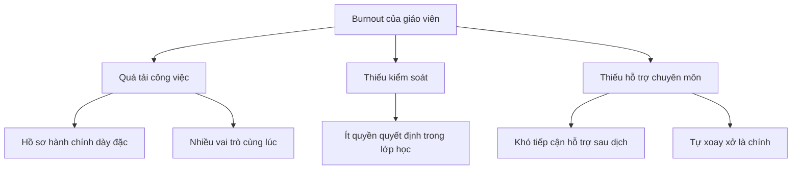

# Chương 12: Visualization & Trình Bày Dữ Liệu


---

> *"The greatest value of a picture is when it forces us to notice what we never expected to see."* — John Tukey

---

Rất nhiều người xem trực quan hóa dữ liệu như bước cuối cùng: phân tích xong rồi mới “vẽ biểu đồ cho đẹp”. Đó là một hiểu lầm lớn. Trong nghiên cứu, visualization không chỉ là trang trí cho kết quả; nó là một phần của tư duy phân tích. Một biểu đồ tốt không chỉ cho người khác xem. Nó còn giúp chính người nghiên cứu nhìn ra mẫu hình, ngoại lệ, mối quan hệ, và đôi khi là cả lỗi trong dữ liệu hoặc lỗi trong giả định của mình.

Vì vậy, chương này không đi theo câu hỏi “dùng thư viện nào để vẽ chart”. Câu hỏi trung tâm ở đây là: **làm thế nào để kể đúng câu chuyện của dữ liệu mà không bóp méo nó**.

Điều này đặc biệt quan trọng khi bạn đang viết luận văn, bài báo, hoặc chuẩn bị bảo vệ. Một figure yếu có thể làm findings tốt trở nên mờ nhạt. Ngược lại, một figure mạnh có thể khiến người đọc hiểu ngay điều bạn phải mất nửa trang văn bản mới giải thích được. Nhưng hình mạnh không đồng nghĩa với hình nhiều màu, phức tạp, hay “trông hiện đại”. Hình mạnh là hình:

- trả lời đúng một câu hỏi;
- làm nổi bật đúng một thông điệp;
- trung thực với dữ liệu;
- và đủ rõ để người đọc không phải đoán.

Antigravity hỗ trợ tốt ở chỗ bạn có thể đi liền một mạch từ dữ liệu thô, sang phân tích, rồi sang code tạo hình, caption, slide, và cả infographic hoặc dashboard. Nhưng giống như mọi chương khác trong sách này, công cụ chỉ là phần trợ lực. Quyết định khoa học vẫn nằm ở bạn: **nên cho người đọc thấy điều gì, ở mức nào, và với độ chắc chắn ra sao**.

Theo nghĩa đó, `Chương 12` không đứng một mình. Nó nhận đầu vào từ `Chương 10` và `Chương 11`: các mô hình, các themes, các matrix, các findings đã đủ chín để được “cho nhìn thấy”. Một figure tốt vì thế không chỉ là hình đẹp; nó là nơi kết quả phân tích được nén lại thành một đơn vị lập luận mà người đọc có thể nắm bắt nhanh.

---

## 12.1 Visualization Không Phải Bước Trang Trí

Có ít nhất ba vai trò khác nhau của visualization trong nghiên cứu:

### 1. Visualization để khám phá

Đây là giai đoạn bạn chưa chắc dữ liệu “nói” điều gì. Biểu đồ được dùng để:

- kiểm tra phân phối;
- phát hiện outliers;
- nhìn tương quan ban đầu;
- kiểm tra dữ liệu thiếu;
- so sánh sơ bộ giữa các nhóm.

Ở giai đoạn này, biểu đồ có thể chưa đẹp. Điều quan trọng là nó giúp bạn nghĩ.

### 2. Visualization để chứng minh

Khi viết bài báo hoặc luận văn, figure không còn chỉ để bạn khám phá nữa. Nó trở thành bằng chứng hỗ trợ cho một điểm trong lập luận. Lúc này câu hỏi không còn là “dữ liệu trông thế nào?”, mà là “người đọc cần nhìn thấy điều gì để hiểu kết quả này?”

### 3. Visualization để truyền thông

Khi đi sang seminar, lớp học, policy brief, hay nội dung cho công chúng, hình ảnh phải được thiết kế cho tốc độ tiếp nhận cao hơn. Điều đó đòi hỏi bạn phải đơn giản hóa, nhưng không được đơn giản hóa đến mức làm sai.

### Một nguyên tắc rất hữu ích

> Mỗi figure nên có một công việc chính.

Nếu một hình cùng lúc cố:

- trình bày tất cả biến chính,
- so sánh tất cả nhóm,
- thể hiện xu hướng theo thời gian,
- và thêm annotation về ý nghĩa thống kê,

thì rất có thể nó đang làm quá nhiều việc và không làm tốt việc nào.

---

## 12.2 Một Thông Điệp, Một Figure

Đây là nguyên tắc nên đi theo bạn suốt từ giai đoạn phân tích đến lúc trình bày trước hội đồng.

### Hãy tự hỏi trước khi vẽ

Figure này cần giúp người đọc thấy điều gì?

Ví dụ:

- “Nhóm can thiệp có điểm trung bình cao hơn nhóm đối chứng.”
- “Mối quan hệ giữa hai biến không tuyến tính.”
- “Ba theme này không tách rời nhau, mà nối bằng một cơ chế chung.”
- “Kết quả có cải thiện, nhưng chỉ ở một số bối cảnh cụ thể.”

Nếu bạn chưa viết được câu đó thành một câu đơn, hãy khoan vẽ.

### Hai ví dụ song hành

#### 🧪 Ví dụ Tự Nhiên: Điểm STEM của học sinh

Thông điệp yếu:

“Đây là biểu đồ kết quả của nghiên cứu.”

Thông điệp mạnh:

“Hiệu quả của mô hình STEM xuất hiện rõ ở trường có hỗ trợ triển khai cao, chứ không đồng đều ở mọi bối cảnh.”

Từ đó, bạn sẽ không chọn một bar chart chung chung cho toàn bộ mẫu nữa; bạn có thể cần figure phân tầng theo loại trường hoặc mức hỗ trợ.

#### 📊 Ví dụ Xã Hội: Burnout giáo viên

Thông điệp yếu:

“Đây là word cloud từ phỏng vấn.”

Thông điệp mạnh:

“Burnout trong trải nghiệm giáo viên không chỉ là quá tải công việc, mà còn gắn với cảm giác thiếu kiểm soát và thiếu hỗ trợ.”

Từ đó, thay vì word cloud đơn giản, một thematic map hoặc matrix display sẽ phù hợp hơn nhiều.

### Công thức nhanh để kiểm tra figure

Hoàn thành câu sau:

> Figure này cho thấy rằng ____

Nếu bạn điền được một câu rõ, figure có cơ sở tồn tại. Nếu phải viết ba câu mới giải thích xong, hình đó có thể đang quá tải.

---

## 12.3 Chọn Biểu Đồ Theo Câu Hỏi Nghiên Cứu, Không Theo Sở Thích


Nhiều người chọn chart vì quen tay hoặc vì thấy “đẹp”. Trong nghiên cứu, phải chọn chart theo nhiệm vụ nhận thức mà người đọc cần làm.

### Bảng chọn nhanh

| Câu hỏi người đọc cần trả lời | Dạng dữ liệu | Figure thường phù hợp |
|---|---|---|
| Hai hay nhiều nhóm khác nhau ra sao? | Means / distributions | Bar chart có error bars, box plot, violin plot |
| Biến X liên hệ với Y thế nào? | Continuous data | Scatter plot, regression plot |
| Một đại lượng thay đổi theo thời gian ra sao? | Time series | Line chart |
| Tỷ trọng thành phần ra sao? | Composition | Stacked bar, 100% stacked bar |
| Mẫu hình trên ma trận ra sao? | Correlations / intensities | Heatmap |
| Chủ đề và mối liên hệ trong định tính là gì? | Codes / themes | Thematic map, network diagram, matrix display |

### Khi nào bar chart là lựa chọn kém?

Bar chart rất phổ biến, nhưng cũng rất dễ bị lạm dụng.

Không nên ưu tiên bar chart khi:

- bạn muốn cho thấy phân phối dữ liệu;
- mẫu nhỏ và điểm dữ liệu từng cá nhân quan trọng;
- khác biệt nằm ở độ phân tán chứ không chỉ mean;
- hoặc khi box plot/violin plot sẽ trung thực hơn.

### Box plot và violin plot khi nào đáng dùng?

Chúng hữu ích khi bạn muốn người đọc thấy:

- median;
- quartiles;
- outliers;
- hình dạng phân phối.

Đây là điểm mà rất nhiều luận văn định lượng có thể nâng chất lượng chỉ bằng cách đổi loại figure.

### Với định tính thì sao?

Định tính không có nghĩa là “không vẽ được”. Nhưng hình cho định tính phải giúp người đọc thấy cấu trúc ý nghĩa, chứ không phải tạo ấn tượng trực quan hời hợt.

Thường nên ưu tiên:

- thematic map;
- code-to-theme matrix;
- timeline của một quá trình;
- conceptual diagram;
- joint display nếu nghiên cứu hỗn hợp.

> ⚠️ **Cảnh báo:** Word cloud hiếm khi là hình tốt nhất cho nghiên cứu định tính. Nó đẹp và nhanh, nhưng thường nghèo về ý nghĩa phân tích.

---

## 12.4 Những Lỗi Trực Quan Hóa Rất Hay Gặp Trong Luận Văn và Bài Báo

### 1. Dồn quá nhiều thứ vào một hình

Một figure có:

- 6 nhóm màu,
- 2 trục,
- 3 loại ký hiệu,
- 4 dòng chú thích,
- và thêm p-values chen trong hình

thường là dấu hiệu của một figure chưa được biên tập.

### 2. Chọn màu theo cảm tính

Màu quá chói, quá gần nhau, hoặc không thân thiện với người mù màu có thể làm mất ý nghĩa của figure.

Nên ưu tiên:

- palette colorblind-friendly;
- ít màu nhưng có chủ đích;
- màu nhất quán giữa các figure trong cùng công trình.

### 3. Trục cắt sai hoặc scale gây hiểu nhầm

Có những trường hợp cắt trục để nhấn mạnh khác biệt, nhưng nếu không minh bạch, điều này dễ gây cảm giác phóng đại.

### 4. Dùng 3D chart

Trong hầu hết tình huống nghiên cứu, 3D chart làm dữ liệu khó đọc hơn, không phải tốt hơn.

### 5. Figure đẹp nhưng caption vô dụng

Nhiều caption chỉ ghi:

> “Figure 2. Results of analysis.”

Caption như vậy gần như không giúp gì. Caption nên nói rõ người đọc đang nhìn cái gì và điều gì quan trọng.

### 6. Dùng infographic style cho figure học thuật

Một bài báo journal và một bài đăng công chúng không có cùng tiêu chuẩn hình ảnh. Hình quá “marketing” trong một công trình học thuật có thể làm mất cảm giác nghiêm túc và làm mờ bằng chứng.

### Checklist tự rà trước khi chốt hình

- Người đọc có biết ngay figure này muốn nói gì không?
- Có yếu tố trang trí nào không phục vụ dữ liệu không?
- Nếu in đen trắng, hình còn đọc được không?
- Người mù màu có phân biệt được các nhóm không?
- Caption đã nói rõ context, biến, và takeaway chưa?

---

## 12.5 Figures Cho Nghiên Cứu Định Lượng

### Từ output thống kê đến figure có ý nghĩa

Figure tốt không chỉ “vẽ lại bảng”. Nó nên làm nổi bật điều quan trọng hơn bảng.

Ví dụ, nếu bảng regression cho thấy:

- biến A có tác động dương,
- biến B không có ý nghĩa,
- hiệu ứng khác nhau theo nhóm,

thì có thể bạn không cần một bảng nữa trong slide; bạn cần một figure cho thấy hiệu ứng theo nhóm một cách trực quan hơn.

### Prompt tạo publication-quality figure

> 📋 **Prompt Template — Publication Figure**
> ```
> Tạo figure chất lượng journal với dữ liệu tại [path]:
> 
> Câu hỏi figure cần trả lời: [viết 1 câu]
> Loại hình dự kiến: [bar / scatter / box / line / heatmap]
> Variables: X = [var], Y = [var], Group = [var nếu có]
> Style: [APA / IEEE / Nature / thesis]
> Size: [single column / double column / slide]
> Colors: colorblind-friendly
> 
> Yêu cầu:
> 1. Viết code reproducible
> 2. Tạo bản PNG 300 dpi và PDF/SVG
> 3. Gợi ý caption 2 câu
> 4. Nêu 2 điểm có thể gây hiểu nhầm nếu trình bày sai
> ```

### Ví dụ: Figure cho khác biệt giữa các nhóm

```python
import matplotlib.pyplot as plt
import seaborn as sns

sns.set_theme(style="whitegrid")

fig, ax = plt.subplots(figsize=(4.2, 3.2))

sns.boxplot(
    data=df,
    x="school_type",
    y="problem_solving_score",
    palette=["#4C78A8", "#F58518", "#54A24B"],
    linewidth=1,
    ax=ax,
)

sns.stripplot(
    data=df,
    x="school_type",
    y="problem_solving_score",
    color="black",
    alpha=0.35,
    size=3,
    ax=ax,
)

ax.set_xlabel("Loại trường")
ax.set_ylabel("Điểm giải quyết vấn đề")
ax.set_title("Phân phối điểm theo loại trường")
ax.spines["top"].set_visible(False)
ax.spines["right"].set_visible(False)

plt.tight_layout()
plt.savefig("results/figures/problem-solving-by-school-type.png", dpi=300)
plt.savefig("results/figures/problem-solving-by-school-type.pdf")
```

### Vì sao ví dụ này tốt hơn bar chart trung bình?

Vì người đọc nhìn thấy:

- trung vị;
- độ phân tán;
- outliers;
- và cả dữ liệu từng điểm ở mức vừa đủ.

Điều này thường trung thực hơn với dữ liệu thật.

### Khi nào nên dùng line chart?

Line chart phù hợp khi trục X là:

- thời gian;
- trình tự đo lường;
- hoặc một continuum có ý nghĩa thứ tự.

Đừng dùng line chart cho các nhóm rời rạc không có logic liên tục, vì nó khiến người đọc ngầm hiểu có một tiến trình giữa các nhóm đó.

---

## 12.6 Hình Ảnh Cho Nghiên Cứu Định Tính

Định tính không có nghĩa là “không trực quan hóa được”. Ngược lại, trực quan hóa tốt có thể giúp người đọc thấy cấu trúc chủ đề nhanh hơn rất nhiều.

### 1. Thematic map

Đây thường là lựa chọn mạnh nhất. Nó cho thấy:

- themes chính;
- sub-themes;
- mối quan hệ giữa chúng;
- và đôi khi là tiến trình hoặc cơ chế.

### 2. Matrix display

Rất hữu ích khi bạn muốn cho thấy:

- nhóm nào nhấn mạnh chủ đề nào;
- trường hợp nào có pattern nào;
- hoặc sự khác biệt giữa các bối cảnh.

### 3. Process diagram

Phù hợp với grounded theory, case study, hoặc nghiên cứu về hành trình/trải nghiệm có nhiều giai đoạn.

### 4. Word cloud: dùng rất thận trọng

Word cloud có thể hữu ích như một artifact phụ trong giảng dạy hoặc truyền thông đại chúng, nhưng hiếm khi nên là hình trung tâm trong luận văn hoặc bài báo định tính.

### Ví dụ: thematic map bằng Mermaid



### Prompt dựng thematic map

> 📋 **Prompt Template — Qualitative Visualization**
> ```
> Dựa trên codebook và themes sau:
> [paste themes]
> 
> Hãy gợi ý 3 cách trực quan hóa:
> 1. Thematic map
> 2. Matrix display
> 3. Process diagram
> 
> Với mỗi cách:
> - nói rõ nó giúp người đọc thấy điều gì
> - khi nào nên dùng
> - khi nào không nên dùng
> 
> Sau đó tạo một Mermaid draft cho phương án tốt nhất.
> ```

### Điều cần nhớ

Với định tính, visualization không thay thế trích dẫn. Hình giúp người đọc thấy cấu trúc. Trích dẫn giúp người đọc nghe được giọng nói của người tham gia.

---

## 12.7 Figure Caption, Annotation và Table-Figure Pairing

Caption là phần nối giữa dữ liệu trực quan và lập luận bằng chữ. Nếu caption yếu, figure rất dễ bị “thả nổi”.

### Caption tốt nên có gì?

Thường chỉ cần 2 câu, nhưng phải đủ chức năng:

- câu 1: nói figure hiển thị cái gì, với biến nào, bối cảnh nào;
- câu 2: nói điều gì đáng chú ý nhất mà người đọc nên nhìn ra.

### Ví dụ caption yếu và mạnh

**Caption yếu:**

> Figure 3. Kết quả khảo sát.

**Caption mạnh:**

> Figure 3. Phân phối điểm giải quyết vấn đề của học sinh theo loại trường sau can thiệp STEM. Nhóm trường có mức hỗ trợ triển khai cao cho thấy median cao hơn và độ phân tán thấp hơn, gợi ý tác động của can thiệp phụ thuộc vào điều kiện tổ chức.

### Annotation có nên dùng không?

Có, nhưng tiết chế. Annotation hữu ích khi:

- cần đánh dấu khác biệt chính;
- chỉ ra vùng quan trọng;
- nêu một finding bất ngờ;
- hoặc làm rõ đường xu hướng.

Không nên annotation đến mức figure trở thành một trang ghi chú.

### Bảng và hình nên phối với nhau ra sao?

Thông thường:

- bảng giữ số chính xác;
- figure cho thấy mẫu hình.

Nếu một bảng và một figure đang lặp lại y hệt cùng một nội dung, hãy bỏ một trong hai.

### Prompt tạo caption học thuật

> 📋 **Prompt Template — Figure Caption Writer**
> ```
> Đây là figure của tôi:
> - Figure type: [type]
> - Variables: [list]
> - Main takeaway: [1 câu]
> - Audience: [journal / thesis / slide]
> 
> Hãy viết:
> 1. Một caption 2 câu cho bài báo/luận văn
> 2. Một phiên bản rút gọn cho slide
> 3. Một câu annotation ngắn nếu cần
> ```

---

## 12.8 Infographic và Trực Quan Hóa Cho Truyền Thông

Infographic không có cùng tiêu chuẩn với figure học thuật. Nó phục vụ mục tiêu khác:

- tiếp cận nhanh;
- ghi nhớ tốt;
- dễ chia sẻ;
- phù hợp với audience ngoài chuyên môn.

### Khi nào infographic đáng dùng?

- Tóm tắt findings cho seminar hoặc website nhóm nghiên cứu
- Chia sẻ cho đối tượng không chuyên
- Tạo tài liệu đi kèm cho briefing doc
- Giảng dạy hoặc truyền thông công chúng

### Khi nào không nên dùng infographic làm hình trung tâm?

- Khi nộp journal yêu cầu figure học thuật;
- Khi cần cho thấy số liệu chính xác;
- Khi đối tượng đọc cần đánh giá độ chặt phương pháp.

### Prompt tạo infographic

> 📋 **Prompt Template — Research Infographic**
> ```
> Tạo infographic cho nghiên cứu của tôi:
> - Audience: [công chúng / sinh viên / nhà quản lý]
> - Orientation: [portrait / landscape]
> - Style: [professional / minimal / educational]
> 
> Nội dung cần có:
> 1. Vấn đề nghiên cứu
> 2. 3 findings chính
> 3. 1 đoạn về giới hạn hoặc lưu ý diễn giải
> 4. 1 phần "vì sao điều này quan trọng"
> ```

### Một nguyên tắc rất quan trọng

Infographic phải là **bản dịch** của nghiên cứu, không phải bản thay thế cho nghiên cứu.

---

## 12.9 Interactive Dashboard: Khi Nào Nên và Không Nên

Dashboard rất hấp dẫn, nhưng không phải lúc nào cũng cần.

### Dashboard phù hợp khi:

- người xem cần khám phá dữ liệu theo nhiều chiều;
- có audience nội bộ hoặc stakeholder muốn tự lọc dữ liệu;
- bạn đang chuẩn bị seminar, workshop, hoặc báo cáo tương tác;
- mục tiêu là exploration và discussion.

### Dashboard không phù hợp khi:

- bạn cần một figure tĩnh để nộp bài báo;
- audience chỉ cần 1-2 thông điệp chính;
- dữ liệu nhạy cảm không nên mở ở dạng tương tác;
- dashboard làm người xem lạc khỏi lập luận chính.

### Ví dụ Plotly đơn giản

```python
import plotly.express as px

fig = px.scatter(
    df,
    x="experience_years",
    y="teaching_effectiveness",
    color="region",
    size="class_size",
    hover_data=["school_code"],
    title="Hiệu quả giảng dạy theo kinh nghiệm và khu vực",
)

fig.write_html("results/dashboard/teacher-effectiveness.html")
```

### Câu hỏi phải tự hỏi trước khi làm dashboard

- Người dùng có cần tự khám phá không?
- Hay họ chỉ cần tôi kể một câu chuyện rõ ràng?

Nếu là vế sau, figure tĩnh thường mạnh hơn.

---

## 12.10 Accessibility, Visual Ethics và Reproducibility

Đây là phần rất dễ bị bỏ quên, nhưng lại là dấu hiệu của sự chuyên nghiệp.

### Accessibility

Hãy kiểm tra:

- màu có thân thiện với người mù màu không;
- chữ có đủ lớn không;
- contrast có đủ mạnh không;
- figure in ra còn đọc được không;
- nếu chiếu trên màn hình máy chiếu, thông tin còn rõ không.

### Visual ethics

Trực quan hóa cũng có thể gây lệch nhận thức nếu người nghiên cứu:

- cắt trục một cách không minh bạch;
- chỉ chọn phần dữ liệu đẹp;
- dùng màu sắc hoặc kích thước để thổi phồng khác biệt;
- hoặc bỏ qua uncertainty.

### Reproducibility

Mọi figure quan trọng nên có:

- code hoặc quy trình tạo lại;
- đường dẫn dữ liệu rõ;
- phiên bản cuối được lưu có tổ chức;
- và tốt nhất là cùng nằm trong pipeline phân tích.

### Prompt kiểm tra visual ethics

> 📋 **Prompt Template — Visual Ethics Check**
> ```
> Hãy review figure/table plan của tôi theo 4 tiêu chí:
> 1. Có chỗ nào dễ gây hiểu nhầm không?
> 2. Scale/trục/màu có công bằng với dữ liệu không?
> 3. Figure có đủ accessible không?
> 4. Có thiếu uncertainty, limitations, hoặc context quan trọng nào không?
> ```

---

## 12.11 Workflow Gợi Ý Với Antigravity

Một workflow thực dụng cho chương này có thể là:

1. Dùng code execution để khám phá dữ liệu và vẽ exploratory figures.
2. Chốt 1 câu thông điệp cho từng figure chính.
3. Tạo publication figure bằng code reproducible.
4. Viết caption học thuật và phiên bản rút gọn cho slide.
5. Nếu cần truyền thông rộng hơn, chuyển sang infographic hoặc dashboard.
6. Rà lại bằng checklist về ethics, accessibility, và communication risk.

### Prompt tổng hợp

> 📋 **Prompt Template — End-to-End Visualization Workflow**
> ```
> Tôi cần trực quan hóa kết quả nghiên cứu của mình.
> 
> Dữ liệu: [mô tả]
> Câu hỏi nghiên cứu: [RQ]
> Audience: [journal / thesis / defense / public]
> 
> Hãy:
> 1. Gợi ý 3 figure phù hợp nhất
> 2. Với mỗi figure, nói rõ thông điệp chính
> 3. Chỉ ra figure nào nên làm trước
> 4. Viết code draft cho figure ưu tiên
> 5. Đề xuất caption
> 6. Nêu 3 lỗi diễn giải mà tôi cần tránh
> ```

---

## 12.12 Bài Tập Thực Hành

### 🔧 Hands-on 12.1: One Message, One Figure

Chọn một finding trong nghiên cứu của bạn. Viết ra một câu duy nhất mô tả điều người đọc cần thấy. Sau đó mới chọn chart phù hợp.

### 🔧 Hands-on 12.2: Quant Figure Upgrade

Lấy một bar chart bạn đang có và tự hỏi:

- nó có đang che mất phân phối không;
- có nên đổi sang box plot, violin plot, hoặc scatter không;
- caption có nói rõ takeaway chưa.

### 🔧 Hands-on 12.3: Qualitative Visual

Từ codebook hoặc themes hiện có, tạo một thematic map hoặc matrix display thay cho word cloud.

### 🔧 Hands-on 12.4: Visual Ethics Audit

Rà 3 figure hiện có của bạn và ghi lại:

- 1 chỗ có thể gây hiểu nhầm;
- 1 cải tiến về accessibility;
- 1 điểm cần thêm context hoặc uncertainty.

---

## 12.13 Tóm Tắt Chương

Visualization là một phần của tư duy nghiên cứu, không chỉ là phần trình bày sau cùng. Figure mạnh giúp người đọc thấy điều quan trọng nhanh hơn, nhưng chỉ khi nó được xây quanh một thông điệp rõ, chọn đúng loại hình cho đúng câu hỏi, và giữ trung thực với dữ liệu. AI có thể giúp bạn tạo figure, caption, infographic, hay dashboard nhanh hơn; nhưng việc quyết định nên kể câu chuyện nào và kể nó một cách có trách nhiệm vẫn là công việc của nhà nghiên cứu.

**Deliverable cuối chương:** đến đây, bạn nên có một `visualization kit` gồm:

- 3 figure chính gắn với 3 thông điệp rõ;
- caption học thuật cho từng figure;
- ít nhất 1 trực quan hóa phù hợp cho định tính hoặc mixed methods;
- 1 checklist visual ethics và accessibility;
- 1 phiên bản rút gọn cho slide hoặc truyền thông.

Từ đây, bạn không còn bước vào `Chương 13` với những output rời rạc nữa. Bạn bước vào phần viết với một bộ hình, caption và thông điệp đã được chắt lọc, đủ để nâng đỡ cho Results, Discussion, seminar slides hay các sản phẩm truyền thông sau đó.

---

> 📖 **Tiếp theo:** [Chương 13: Viết Bài Báo Khoa Học →](../05-hoan-thien/chuong-13-viet-bai-bao.md)
